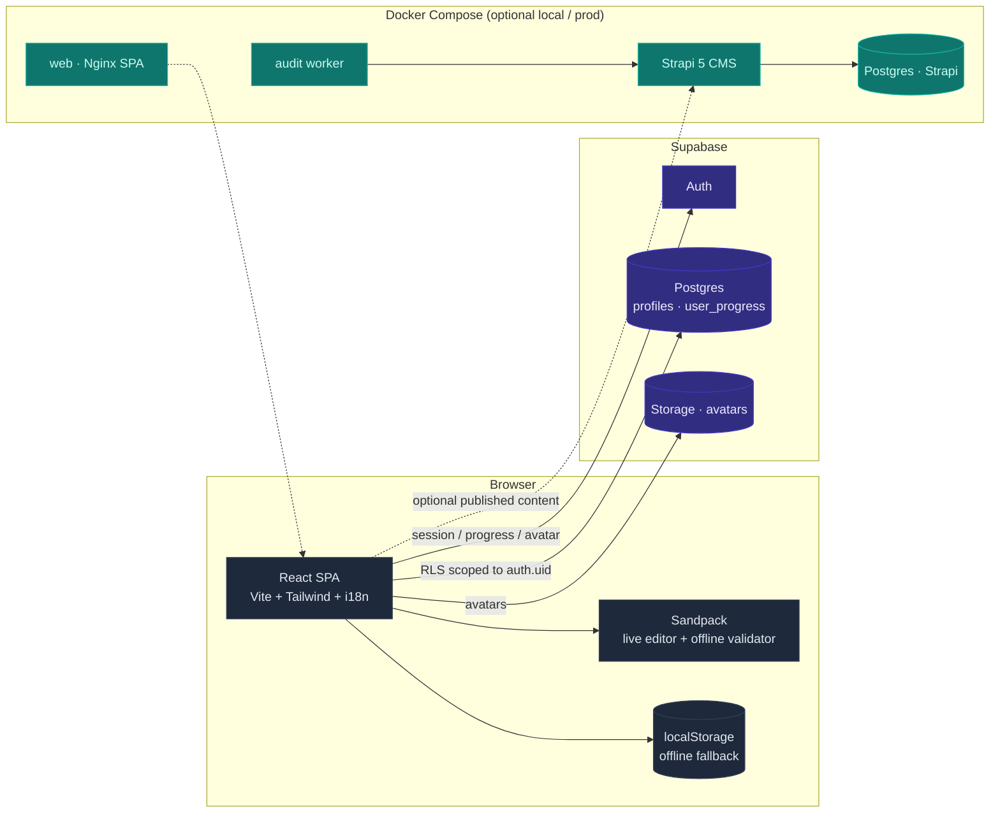
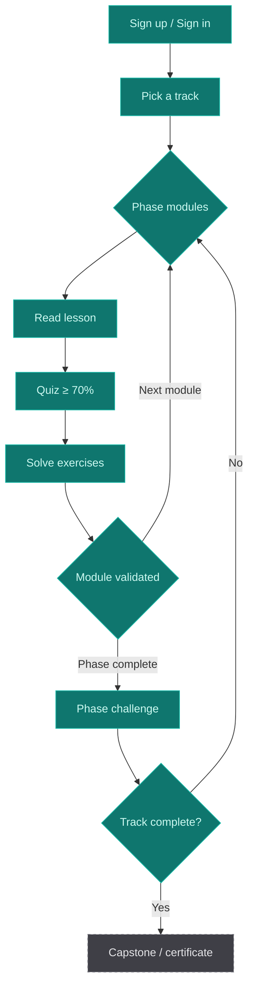

# Mezes Academy

Mezes Academy is an interactive, certifying learning platform.  
Learners pick a track, work through phases with lessons, quizzes, and live
exercises, then prove they can ship.

**Active tracks**

| Track | Route (FR) | Route (EN) | Status |
|-------|------------|------------|--------|
| **React, from zero to expert** | `/react` | `/en/react` | Active |
| **Secure Vibe Coding** | `/secure-vibe-coding` | `/en/secure-vibe-coding` | Active |

> Stack: Vite · React 18 · TypeScript · Tailwind · Sandpack · Supabase · Strapi 5 · Docker

Related docs: [CONTRIBUTING.md](./CONTRIBUTING.md) · [deploy.md](./deploy.md) · [PRODUCT.md](./PRODUCT.md) · [DESIGN.md](./DESIGN.md)

---

## Architecture at a glance

### System topology



Course content ships as **typed TypeScript** under `src/data/courses/` (source of truth for the SPA today).  
Strapi holds the editorial CMS + seed import/export pipeline; runtime Strapi content is gated by `VITE_STRAPI_CONTENT_ENABLED` (default `false`).

### Learner journey



---

## Product vision

- **Learn for real** — each module validates with a quiz and hands-on work, plus anti-cheat friction where it matters (the editor).
- **Prove it ships** — tracks aim at a capstone and certificate, not video completion.
- **Be portable** — account, profile, and cloud-synced progress belong to the learner.
- **Multi-track, multi-locale** — FR is unprefixed; EN lives under `/en/...`.

> Pedagogy over volume. Friction over comfort. Results over completion rate.

---

## Core features

### Learning

- **Multi-course catalog** with per-track layouts (sidebar, progress, search, bookmarks).
- **Rich lesson blocks**: titles, paragraphs, info boxes, highlights, lesson lists, code.
- **Quizzes** (single / multi-select, explanations, 70% pass).
- **Live code exercises** via [Sandpack](https://sandpack.codesandbox.io/), hints, gated solutions, offline validator.
- **Phase challenges** replaying exercises without solution access.
- **Secure Vibe Coding**: Prompt → Audit → Ship curriculum, program blueprints, audit-oriented exercises, worker self-check.

### i18n

- Locales: **`fr`** (default, no URL prefix) and **`en`** (`/en/...`).
- UI chrome via `src/i18n/messages/{fr,en}.ts`.
- Course content has locale-aware builders (`buildReactCourse` / `buildSvcCourse`).
- Guests switch language from the globe menu; signed-in users from account preferences.

### Account & progression

- Supabase Auth (email + password); private admin entry at `/access/<slug>`.
- Progress: local-first (`react-learn:progress:v3`) + cloud sync with visible sync badge.
- **Progress page** aggregates **all active courses** (phase accordion when multiple tracks).
- Account: avatar, profile, theme (default **dark**), security, language.

### Platform (ops)

- **Docker Compose**: `web` · `strapi` · `postgres` · `worker` — see [deploy.md](./deploy.md).
- **CI/CD** (GitHub Actions): lint, types, Vitest, Strapi build, CodeQL, Trivy (FS / config / images), deploy gate.
- Seed export: `npm run export:strapi-seed` → `strapi/src/seed/`.

---

## Getting started

Prerequisites: **Node.js ≥ 20**, npm.

```bash
npm install
cp .env.example .env        # Supabase (+ optional Strapi / Compose vars)
npm run dev
```

App: [http://localhost:5173](http://localhost:5173) (FR) · [http://localhost:5173/en](http://localhost:5173/en) (EN).

### Supabase setup

1. Create a Supabase project.
2. In `.env` set `VITE_SUPABASE_URL` and `VITE_SUPABASE_ANON_KEY` (or `VITE_SUPABASE_PUBLISHABLE_KEY`).
3. Run `supabase/schema.sql` in the SQL Editor (idempotent).
4. Restart `npm run dev`.

Schema highlights: `profiles`, `user_progress`, RLS, `avatars` bucket (2 MB, image-only).

### Full stack (Docker)

**Local / dev** (build depuis le source) :

```bash
cp .env.example .env
docker compose up -d --build
```

**Production** : pas de clone sur le VPS — images GHCR + `docker-compose.prod.yml` uniquement. Voir **[deploy.md](./deploy.md)**.

| Service | URL (compose local) |
|---------|---------------------|
| Web | http://localhost:5173 |
| Strapi | http://localhost:1337 |
| Worker health | http://localhost:8090/health |

### Scripts

| Script | Purpose |
|--------|---------|
| `npm run dev` | Vite dev server |
| `npm run build` | Type-check + production bundle |
| `npm run preview` | Serve `dist/` locally |
| `npm run lint` | ESLint |
| `npm run type-check` | `tsc --noEmit` |
| `npm test` | Vitest (`src/**/*.test.ts`) |
| `npm run quality` | lint + types + tests + build |
| `npm run export:strapi-seed` | Export course JSON seeds for Strapi |

---

## Repository layout

```
react-learn/
├── .github/workflows/         # CI (quality + Trivy + CodeQL) · Deploy
├── deploy.md                  # Ops / CI/CD guide
├── docker-compose.yml
├── Dockerfile                 # SPA → nginx-unprivileged :8080
├── nginx.conf
├── supabase/schema.sql
├── scripts/export-course-seed.ts
├── strapi/                    # Strapi 5.51.x CMS + seed import
├── worker/                    # Deterministic audit worker
└── src/
    ├── App.tsx                # Routes, locale prefixes, guards
    ├── i18n/                  # LocaleProvider, messages, path helpers
    ├── data/courses/          # react + svc (FR/EN content & programs)
    ├── hooks/                 # useAuth, useProgress, …
    ├── components/            # layout, learning, account, ui, course
    ├── pages/                 # Landing, course homes, modules, progress
    └── lib/                   # supabase, progressRemote, courseProgress, …
```

### Key patterns

- **Single progress store** — `ProgressProvider` syncs `localStorage` ↔ Supabase; `sync` state drives `SyncStatusBadge`.
- **Course areas** — `courseArea` + `CourseLayout` scope nav, search, and progress per track.
- **Progress math** — shared helpers in `src/lib/courseProgress.ts` (phases, course totals, active courses).
- **Route protection** — course trees and `/account` behind `<RequireAuth>`; guests redirected to `/auth?next=...`.
- **Declarative content** — new modules are typed data; `ContentBlock` is an exhaustive discriminated union.
- **Anti-cheat in the editor** — paste/solution locks target Sandpack, not the whole page.

---

## Adding content

### React module (example)

```ts
// src/data/courses/react/.../modules/12-components-props.ts
{
  id: "react-core-m12",
  index: "M12",
  title: "Components & Props",
  subtitle: "Build reusable UI units",
  duration: "2 h",
  content: [
    { kind: "paragraph", html: "React is all about <strong>components</strong>..." },
    { kind: "info", box: { variant: "tip", title: "Tip", body: "..." } },
  ],
  quiz: { /* ... */ },
  exercises: [ /* ... */ ],
}
```

### `ContentBlock` variants

| kind | Usage |
|------|--------|
| `title` | Section heading |
| `paragraph` | Body HTML |
| `info` | Callout (tip / warn / note / concept) |
| `highlight` | Emphasized one-liner |
| `lessons` | Sub-lesson list |
| `code` | Syntax-highlighted sample |

### Strapi seeds

```bash
npm run export:strapi-seed
# then import inside Strapi — see strapi/src/seed/README.md
```

---

## Live exercises (Sandpack + local validator)

Each exercise may define `starterFiles`, `solutionFiles`, `hints`, an offline
`validator`, `template` (`react` | `react-ts` | `vanilla`), and
`attemptsBeforeSolution`. Status: `not-started` | `attempted` | `solved` | `revealed`.

---

## Progress storage

Blob fields: `readModules`, `quizScores`, `exerciseProgress`, `challengeScores`,
`bookmarks`, `theme`.

**Offline-first + cloud sync**

1. No session → `localStorage` only.
2. Sign-in → load remote; if empty, **migrate once** from local.
3. Mutations debounce to Supabase; on outage → local + `Offline` badge + retry.

---

## CI / quality gates

On every PR and push to `main` (see `.github/workflows/ci.yml`):

- ESLint · TypeScript · Vitest · SPA build  
- Worker build + self-check · Strapi install/build  
- Trivy (filesystem, Dockerfile/Compose config, container images)  
- CodeQL (`security-and-quality`)  
- Deploy workflow runs only after a green CI on `main` ([deploy.md](./deploy.md))

Locally:

```bash
npm run quality
```

---

## Roadmap

- Capstone submission + admin review + signed certificates.
- Public gallery / LinkedIn share.
- Tutorial “pro tools” bridge (VS Code, Git, GitHub, Vercel).
- Runtime Strapi content as primary source (`VITE_STRAPI_CONTENT_ENABLED=true`) with editorial workflow.
- Spaced repetition, achievements, PWA polish.

---

## License

© 2026 Mezes Corporation. All rights reserved.
